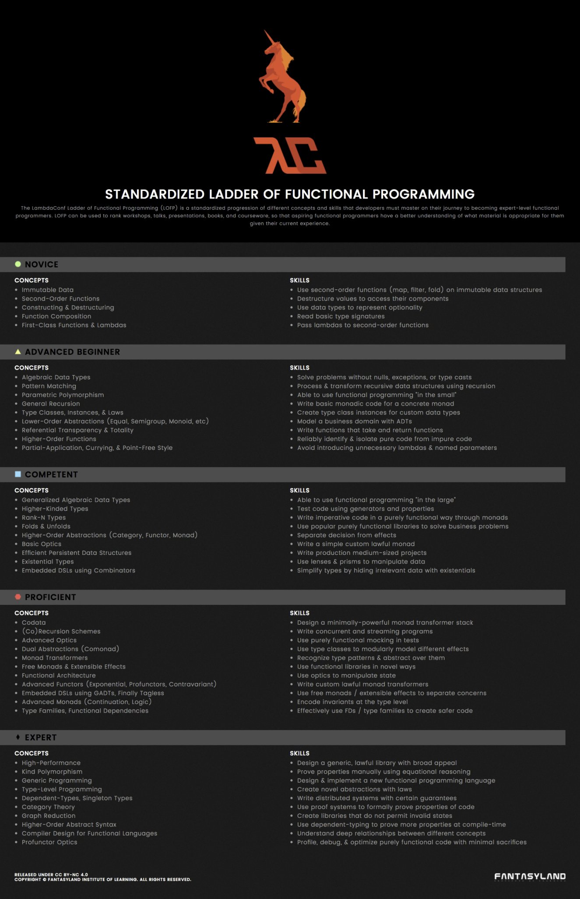

Learning FP through the FP-Ladder
===================

Learning functional programming, according to the roadmap provided by
the document *Standarized Ladder of Functional Programming*.

# Notes

- There is *no* one single book for all these concepts. Resources are
collected from different sites.

- Mathematics (i.e. Algebra) plays a central role at the
  **proficient** level.

- Code files are just simplification for blogs/docs/tutorials

# The Ladder

Copyright reserved for the authors.

<!--  -->

